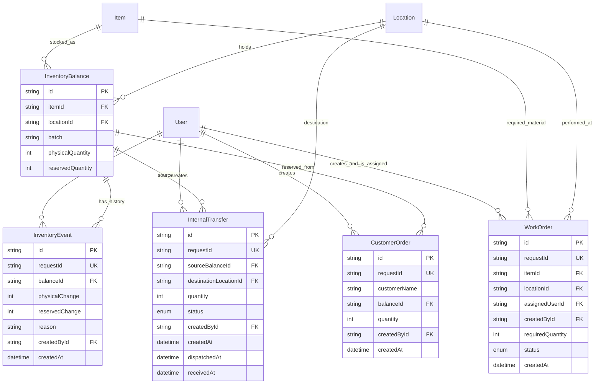

# Operations schema

Source: `apps/api/prisma/schema.prisma`; additive migration: `20260912090000_operations_erp`.

Item has unique `code`, `name`, `category`; Location has unique `name`. Balance has a composite unique key `(itemId, locationId, batch)`. Available is derived, never a separately writable column. Foreign keys restrict deletion of referenced records. CHECK constraints protect nonnegative balances and positive order/work/transfer quantities.

User stores name, email, passwordHash and Role. Only safe user fields are returned. ADMIN, OPERATIONS and SALES are the current required roles; WAREHOUSE and ACCOUNTS are retained for compatibility. Legacy Customer, CustomerFollowUp, Product, StockMovement, Challan and ChallanItem relationships remain unchanged and are outside the diagram above.
